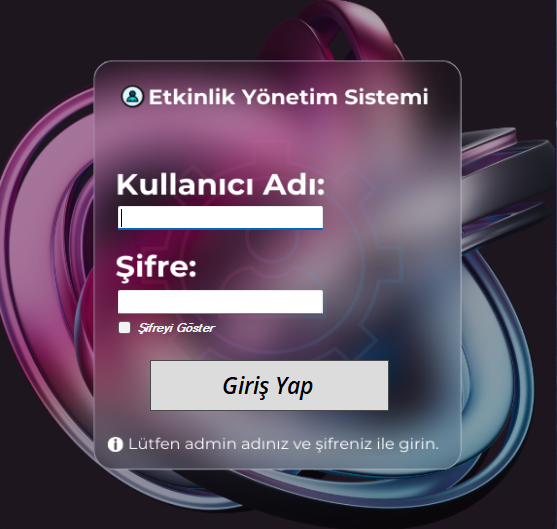
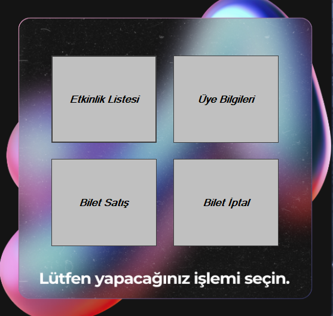
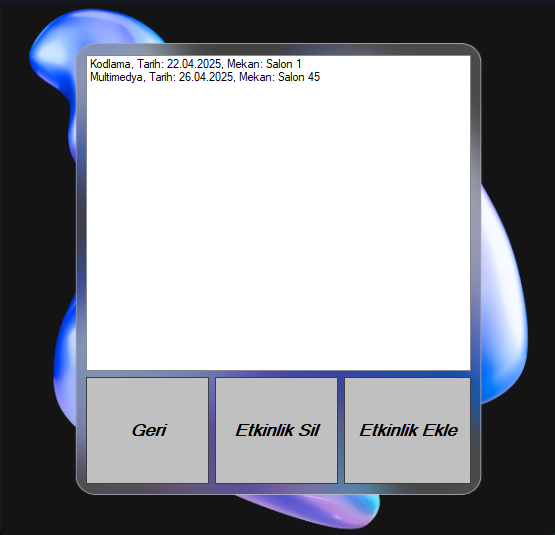
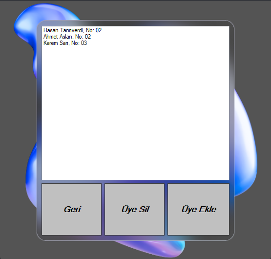
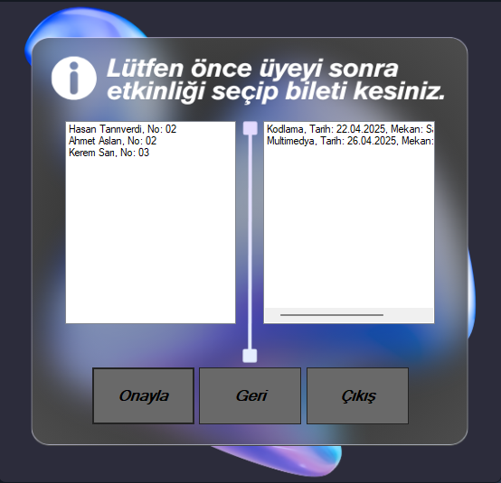
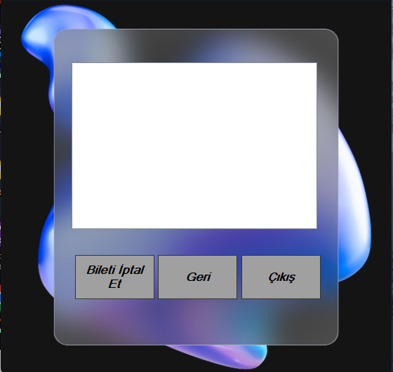

# 🎉 Etkinlik Yönetim Sistemi

Bu proje, **C# Windows Forms** kullanılarak geliştirilmiş bir **Etkinlik Yönetim Sistemi** uygulamasıdır. Kullanıcılar, sistem üzerinden etkinlikleri listeleyebilir, etkinlik detaylarını görüntüleyebilir, etkinliklere katılabilir ve etkinlikleri yönetebilir. Proje eğitim amaçlıdır.

## 🧩 Özellikler

- Etkinlikleri listeleme
- Etkinlik detaylarını görüntüleme
- Etkinliklere katılma
- Etkinlik yönetimi (ekleme, güncelleme, silme)
- Basit ve kullanıcı dostu arayüz

## 🛠️ Kullanılan Teknolojiler

- C# (Windows Forms)
- .NET Framework
- Visual Studio
- (Opsiyonel: JSON, XML ya da SQL Server ile veri saklama)

## 🖼️ Uygulama İçi Ekran Görüntüleri

- **Ana Ekran**  
  

- **Etkinlik Listesi**  
  

- **Etkinlik Detayları**  
  

- **Üye İşlemleri**  
  

- **Etkinlik Yönetimi**  
  

- **Etkinlik Güncelleme**  
  
